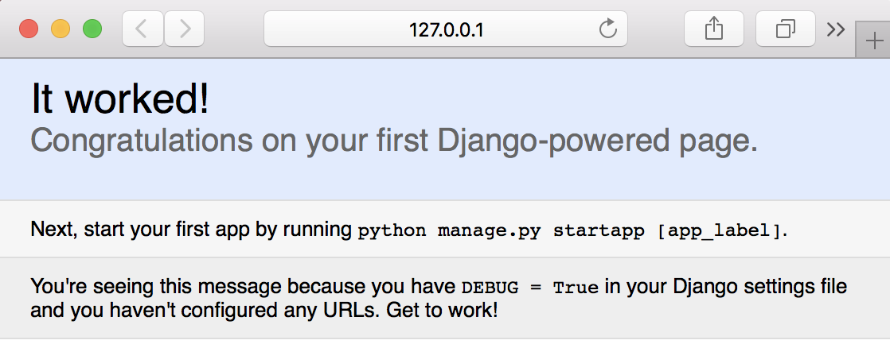

# 01_startproject
01_startproject

### command; 現在のディレクトリにプロジェクトを生成

`$ django-admin startproject my_very_fist_django_project .`

### ディレクトリに生成されたファイルの説明

|ファイル名|説明|
|:-:|:-:|
|manage.py|サイトの管理|
|my_very_first_django_project/settings.py|ウェブサイトの管理|

### TIMEZONEの変更

my_very_first_django_project/settings.py
```
TIME_ZONE = 'Asia/Tokyo' # 108行目
```

### 静的ファイルの参照先を追加

my_very_first_django_project/settings.py
```
STATIC_ROOT = os.path.join(BASE_DIR, 'static') # 121行目
```

### ホワイトリストの追加

my_very_first_django_project/settings.py
```
ALLOWED_HOSTS = ['*'] # 28行目
```

### データベースの設定を確認

すでに、sqlite3が設置されている

my_very_first_django_project/settings.py
```
DATABASES = { # 76行目
    'default': {
        'ENGINE': 'django.db.backends.sqlite3',
        'NAME': os.path.join(BASE_DIR, 'db.sqlite3'),
    }
}
```

### データベースを初期化（migrate）

`$ python manage.py migrate`

```
Operations to perform:
  Apply all migrations: admin, auth, contenttypes, sessions
Running migrations:
  Applying contenttypes.0001_initial... OK
  Applying auth.0001_initial... OK
  Applying admin.0001_initial... OK
  Applying admin.0002_logentry_remove_auto_add... OK
  Applying contenttypes.0002_remove_content_type_name... OK
  Applying auth.0002_alter_permission_name_max_length... OK
  Applying auth.0003_alter_user_email_max_length... OK
  Applying auth.0004_alter_user_username_opts... OK
  Applying auth.0005_alter_user_last_login_null... OK
  Applying auth.0006_require_contenttypes_0002... OK
  Applying auth.0007_alter_validators_add_error_messages... OK
  Applying auth.0008_alter_user_username_max_length... OK
  Applying sessions.0001_initial... OK
```

### Webサーバを起動

`$ python manager.py runserver`

```
Performing system checks...

System check identified no issues (0 silenced).
August 21, 2018 - 02:30:15
Django version 1.11.15, using settings 'my_very_first_django_project.settings'
Starting development server at http://127.0.0.1:8000/
Quit the server with CONTROL-C.
```


