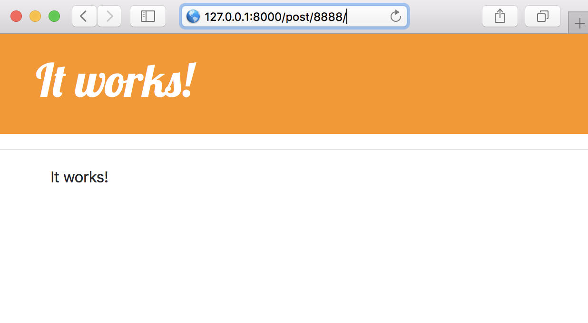
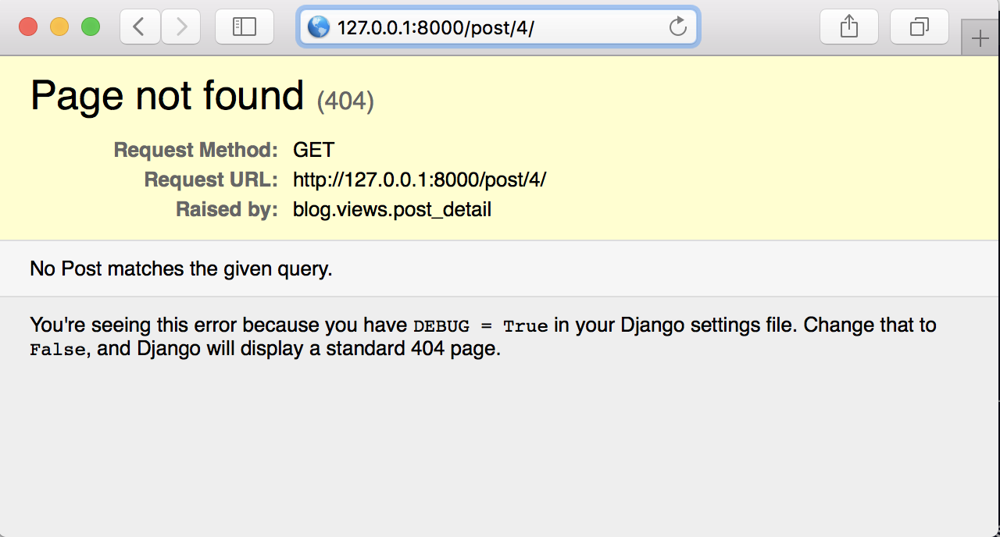
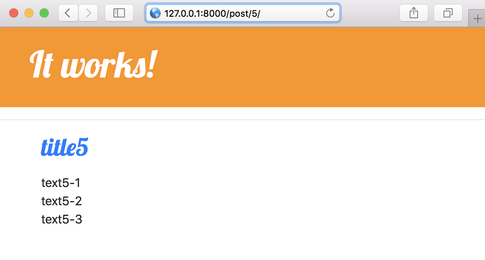
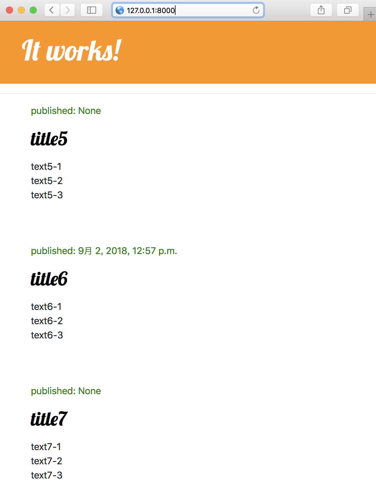
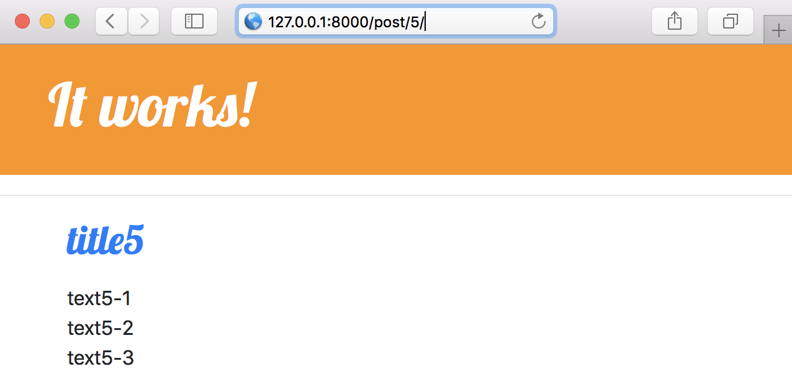

# APP.md

APP.md

先行:

 [02_startapp/README.md](./README.md)

 [02_startapp/CSS.md](./CSS.md)

## 1. APP

### urlを定義

blog/urls.py
```
from django.conf.urls import url
from . import views

urlpatterns = [
    url(r'^$', views.post_list, name='post_list'),
    url(r'^post/(?P<pk>\d+)/$', views.post_detail, name='post_detail'),
]
```

※ `(?P<pk>\d+): パラメータpkとして、1桁以上の数字を渡す。`


blog/views.py
```
from django.shortcuts import render
from .models import Post
from django.utils import timezone

def post_list(request):
    qs = Post.objects.all()
    qs.filter(published_date__lte=timezone.now())
    qs.order_by('published_date')
    return render(request, 'blog/post_list.html', {
        'post_list':qs
    })

def post_detail(request, pk):
    return render(request, 'blog/post_detail.html')
```

blog／templates／blog／post_detail.html
```



    It works!

```





### urlを適用

blog/views.py
```
from django.shortcuts import get_object_or_404, render
...

...
def post_detail(request, pk):
    post = get_object_or_404(Post, pk=pk)
    return render(request, 'blog/post_detail.html', {
        'post':post
    })
```


blog／templates／blog／post_detail.html
```



    <div class="post">
        
            <div class="date">
                <p>published: {{ post.published_date }}</p>
            </div>
        
        <h2>{{ post.title}}</h2>
        <p>{{ post.text|linebreaks }}</p>
    </div>

```

##### /post/4/



##### /post/5/



### urlを活用

blog／templates／blog／post_detail.html
```




    
        <div class="post">
            <div class="date">
                <p>published: {{ post.published_date }}</p>
            </div>
            <h2>
                <a href="">
                    {{ post.title}}
                </a>
            </h2>
            <p>{{ post.text|linebreaks }}</p>
        </div>
    



```




