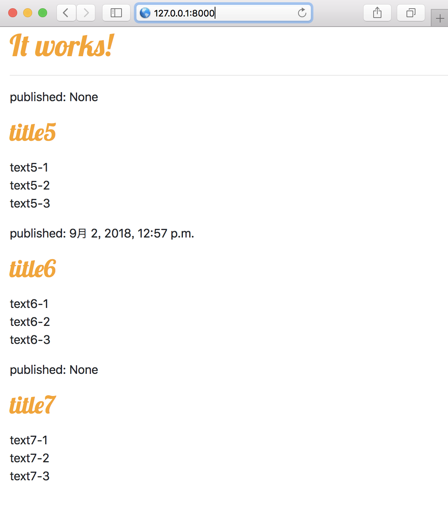
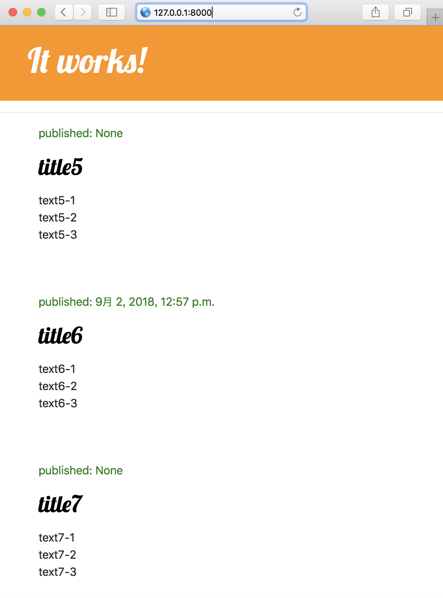
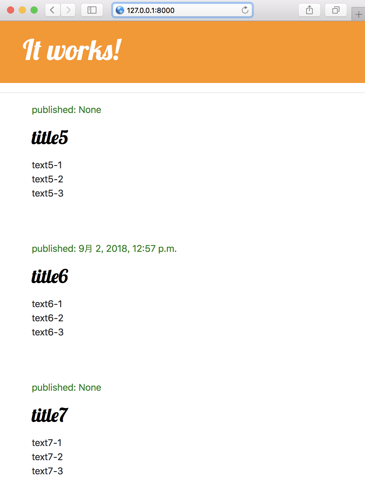

# CSS.md

CSS.md

先行: [02_startapp/README.md](./README.md)

## 1. CSS

### 静的ファイルのディレクトリをプロジェクト内に追加・定義

##### basic

/blog/static/blog/blog.css
```
body {
    padding-left: 15px;
}

h1 a, h2 a {
    color: #FCA205;
    font-family: 'Lobster', cursive;
}
```

/blog/templates/blog/post_list.html
```
<!-- 静的ファイルの確認 -->


<html>
    <head>
        <title>blog</title>
        <!-- bootstrapの読み込み -->
        <!-- https://getbootstrap.com/docs/4.1/getting-started/introduction/#quick-start -->
        <link 
            rel="stylesheet" 
            href="https://stackpath.bootstrapcdn.com/bootstrap/4.1.3/css/bootstrap.min.css" 
            ntegrity="sha384-MCw98/SFnGE8fJT3GXwEOngsV7Zt27NXFoaoApmYm81iuXoPkFOJwJ8ERdknLPMO" 
            crossorigin="anonymous">

        <!-- font familyの追加 -->
        <!-- https://fonts.google.com/selection?selection.family=Lobster -->
        <link rel="stylesheet" href="https://fonts.googleapis.com/css?family=Lobster">

        <!-- 静的ファイルの読み込み -->
        <!-- /static/blog/blog.css -->
        <link rel="stylesheet" href="">
    </head>
    <body>
        <div>
            <h1><a href="/">It works!</a></h1>
        </div>

        <hr/>

        
            <div>
                <p>published: {{ post.published_date }}</p>
                <h2><a href="">{{ post.title }}</a></h2>
                <p>{{ post.text|linebreaks }}</p>
            </div>
        

    </body>
</html>
```



##### advanced

/blog/static/blog/blog.css
```
.page-header {
    background-color: #ff9400;
    margin-top: 0;
    padding: 20px 20px 20px 40px;
}

.page-header h1, .page-header h1 a, .page-header h1 a:visited, .page-header h1 a:active {
    color: #FFFFFF;
    font-size: 36pt;
    text-decoration: none;
}

.content {
    margin-left: 40px;
}

h1, h2, h3, h4 {
    font-family: 'Lobster', cursive;
}

.date {
    color: #828282;
}

.save {
    float: right;
}

.post-form textarea, .post-form input {
    width: 100%;
}

.top-menu, .top-menu:hover, .top-menu:visited {
    color: #FFFFFF;
    float: right;
    font-size: 26pt;
    margin-right: 20px;
}

.post {
    margin-bottom: 70px;
}

.post h1 a, .post h1 a:visited,
.post h2 a, .post h2 a:visited {
    color: #000000;
}

.post .date {
    color: green;
}
```

/blog/templates/blog/post_list.html
```
...
    <body>
        <div class="page-header">
            <h1><a href="/">It works!</a></h1>
        </div>

        <hr/>

        <div class="content container">
            <div class="row">
                <div class="col-md-8">
                    
                        <div class="post">
                            <div class="date">
                                <p>published: {{ post.published_date }}</p>
                            </div>
                            <h2><a href="">{{ post.title }}</a></h2>
                            <p>{{ post.text|linebreaks }}</p>
                        </div>
                    
                </div>
            </div>
        </div>
    </body>
...
```



## 2. テンプレートの継承

### 親テンプレートを作成

blog/templates/blog/base.html
```
<!-- 静的ファイルの確認 -->


<html>
    <head>
        <title>blog</title>
        <!-- bootstrapの読み込み -->
        <!-- https://getbootstrap.com/docs/4.1/getting-started/introduction/#quick-start -->
        <link 
            rel="stylesheet" 
            href="https://stackpath.bootstrapcdn.com/bootstrap/4.1.3/css/bootstrap.min.css" 
            ntegrity="sha384-MCw98/SFnGE8fJT3GXwEOngsV7Zt27NXFoaoApmYm81iuXoPkFOJwJ8ERdknLPMO" 
            crossorigin="anonymous">

        <!-- font familyの追加 -->
        <!-- https://fonts.google.com/selection?selection.family=Lobster -->
        <link rel="stylesheet" href="https://fonts.googleapis.com/css?family=Lobster">

        <!-- 静的ファイルの読み込み -->
        <!-- /static/blog/blog.css -->
        <link rel="stylesheet" href="">
    </head>

    <body>
        <div class="page-header">
            <h1><a href="/">It works!</a></h1>
        </div>

        <hr/>

        <div class="content container">
            <div class="row">
                <div class="col-md-8">

                     <!-- content領域を指定（block） --> 
                    

                </div>
            </div>
        </div>
    </body>
    
</html>
```

### 親テンプレートを継承

blog/templates/blog/post_list.html
```




    
        <div class="post">
            <div class="date">
                <p>published: {{ post.published_date }}</p>
            </div>
            <h2><a href="">{{ post.title }}</a></h2>
            <p>{{ post.text|linebreaks }}</p>
        </div>
    


```


