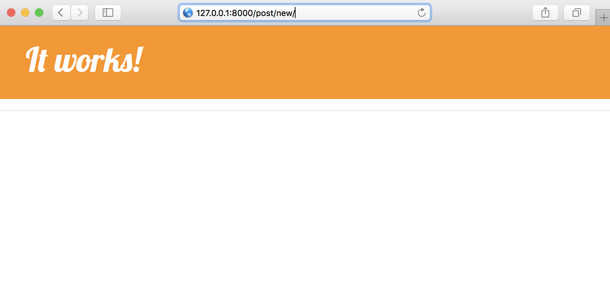

# FORMS.md

FORMS.md

先行:

 [02_startapp/README.md](./README.md)

 [02_startapp/CSS.md](./CSS.md)

 [02_startapp/APP.md](./APP.md)

## 1. FORMS

### formsを定義

##### formsを追加

blog/forms.py
```
from django import forms
from .models import Post

class PostForm(forms.ModelForm):
    class Meta:
        model = Post
        fields = ['title', 'text']
```


##### urlを追加

blog/urls.py
```
from django.conf.urls import url
from . import views

urlpatterns = [
    url(r'^$', views.post_list, name='post_list'),
    url(r'^post/(?P<pk>\d+)/$', views.post_detail, name='post_detail'),
    url(r'^post/new/$', views.post_new, name='post_new'),
]
```


blog/views.py
```
from django.shortcuts import get_object_or_404, render
from .models import Post
from django.utils import timezone
from .forms import PostForm

...

def post_new(request):
    pass
```

##### urlを確認


### formsを適用

```
...
def post_new(request):
    form = PostForm()
    return render(request, 'blog/post_forms_edit.html', {
        'form':form
    })
```

##### templatesを追加

blog/templates/blog/post_forms_edit.html
```




```



##### templatesを適用

blog/templates/blog/post_forms_edit.html

```



    <h1>New Post</h1>
    <form method="POST" class="post-form">
        {{ form.as_p }}
        <button type="submit" class="save btn btn-primary">Save</button>
    </form>

```

blog/templates/blog/base.html
```
<html>
...

    <head>
    ...
        <link 
         rel="stylesheet"
         href="https://maxcdn.bootstrapcdn.com/bootstrap/3.3.7/css/bootstrap.min.css"
         integrity="sha384-BVYiiSIFeK1dGmJRAkycuHAHRg32OmUcww7on3RYdg4Va+PmSTsz/K68vbdEjh4u" 
         crossorigin="anonymous">
    ...
    </head>

    <body>

        <div class="page-header">
            <a href="" class="top-menu">
                <span class="glyphicon glyphicon-plus"></span>
            </a>
            <h1><a href="/">It works!</a></h1>
        </div>
        ...

    </body>

</html>
```

|/|/post/new|
|:-:|:-:|
|||
 
