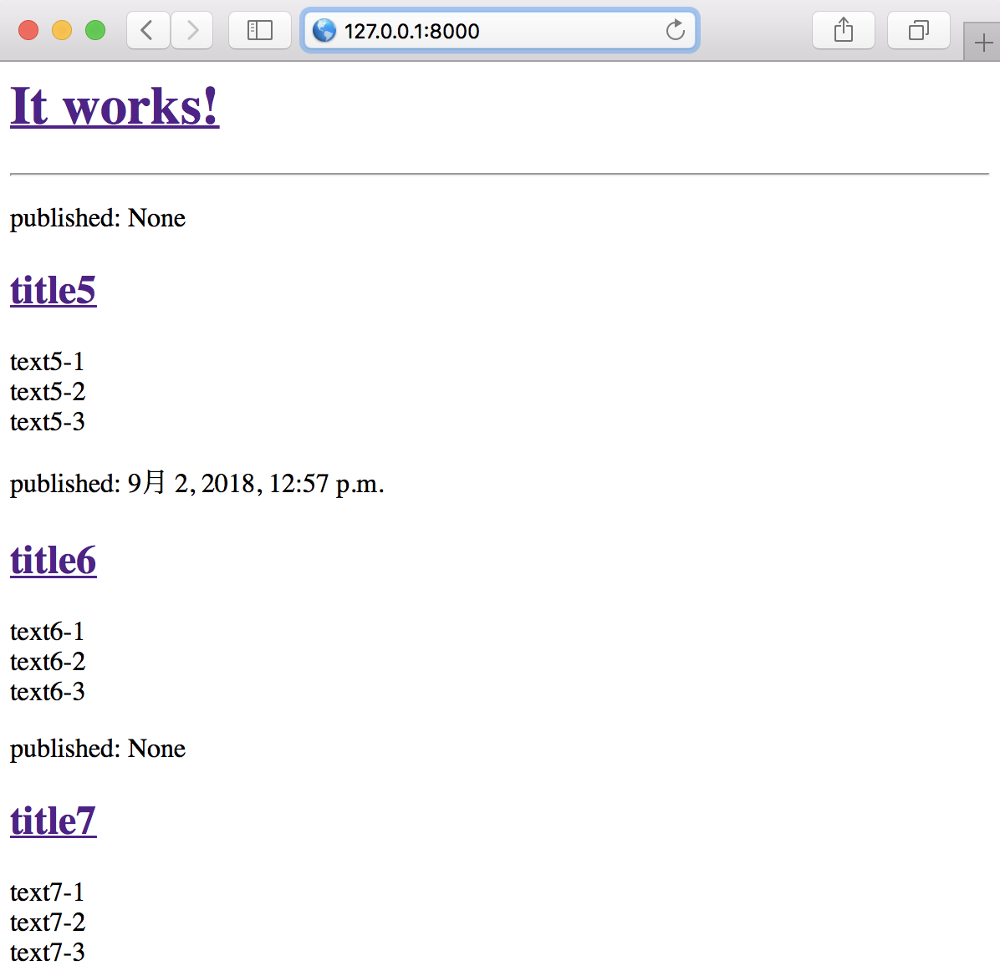

# 02_startapp

02_startapp

先行: 01_startproject

## 1. プロジェクト内にappを生成

`$ python manager.py startapp blog`

### プロジェクト内にappを追加／定義

startapp/settings.py
```
INSTALLED_APPS = [ # 33行目
    ...
    'blog',
]
```

### django appのモデルを定義

startapp/blog/models.py
```
from django.db import models
from django.utils import timezone


# Create your models here.

class Post(models.Model) :
    author = models.ForeignKey('auth.User')
    title = models.CharField(max_length=200)
    text = models.TextField()
    created_date = models.DateTimeField(default=timezone.now)
    published_date = models.DateTimeField(blank=True, null=True)

    def publish(self) :
        self.published_date = timezone.now()
        self.save
    
    def __str__(self) :
        return self.title

```

### 定義したモデルをデータベースに保存

`$ python manage.py makemigrations blog`

`$ python manage.py migrate blog`

### 言語コードを編集

startapp/settings.py
```
LANGUAGE_CODE = 'ko-kr' # 107行目
```


### スーパーユーザーを生成

`python manage.py createsuperuser`


### Postモデルをadminに登録

startapp/blog/admin.py
```
from django.contrib import admin
from .models import Post


# Register your models here.

admin.site.register(Post)
```


## 2. djangoプロジェクトのurlについて

`new file: blog/urls.py`

blog app内に urls.pyを追加

blog/urls.py
```
from django.conf.urls import url
from . import views

urlpatterns = [
    url(r'^$', views.post_list, name='post_list'),
]

```

※urlパターン: ^文字の始まり、$文字の終わり、\d数字、

### djangoプロジェクト内にblog urlsを追加

startapp/urls.py
```
from django.conf.urls import include, url
from django.contrib import admin

urlpatterns = [
    url(r'^admin/', admin.site.urls),
    url(r'', include('blog.urls')),
]
```


### blog app内にviewを追加

blog/views.py
```
from django.shortcuts import render


def post_list(request) :
    return render(request, 'blog/post_list.html')
```

※urlが示しているfunctionをviewという

※url名は: <model名>_<内容>

## 3. blog app内にtemplatesを追加

`new folder: blog/templates`

`new folder: blog/templates/blog`

`new file: blog/templates/blog/post_list.html`

※上記のパスはdjangoのtemplate loadersのルールである

blog/templates/blog/post_list.html
```
<html>
    <head>
        <title>blog</title>
    </head>
    <body>
        <p>It works!</p>
    </body>
</html>
```


## 4. djangoの ORM, Query Sets

`$ python manage.py shell`

Python 3.6.4 ,IPython 6.2.1
```
# Post Modelを取得

In [1]: from blog.models import Post
In [2]: Post
Out[2]: blog.models.Post

In [3]: Post.objects.all()
Out[3]: <QuerySet [<Post: title3>, <Post: title4>, <Post: title5>]>

In [4]: queryset = Post.objects.all()
In [5]: for post in queryset :
   ...:     print(post)
   ...: 
title3
title4
title5

# User Modelを取得

In [6]: from django.contrib.auth.models import User

In [7]: User.objects.all()
Out[7]: <QuerySet [<User: admin>]>

In [8]: me = User.objects.first()

In [9]: me
Out[9]: <User: admin>

In [10]: me.username
Out[10]: 'admin'

In [11]: me.password
Out[11]: 'pbkdf2_sha256$36000$mNBs9gpiXWEE$HLUI8tAaUDnThCW9UB5CVVGe2SeYtYcAJmf6G2rV82A='

# Userを用いて、Post Modelを生成

In [12]: Post.objects.create(author=me, title='title6', text='text6')
Out[12]: <Post: title6>

In [13]: Post.objects.all()
Out[13]: <QuerySet [<Post: title3>, <Post: title4>, <Post: title5>, <Post: title6>]>

In [14]: Post.objects.filter(author=me)
Out[14]: <QuerySet [<Post: title3>, <Post: title4>, <Post: title5>, <Post: title6>]>

In [15]: Post.objects.filter(title__contains='title')
Out[15]: <QuerySet [<Post: title3>, <Post: title4>, <Post: title5>, <Post: title6>]>

# timezoneを取得

In [16]: from django.utils import timezone

In [17]: timezone.now()
Out[17]: datetime.datetime(2018, 9, 2, 3, 37, 54, 926765, tzinfo=<UTC>)

# 発行日で絞る

In [18]: Post.objects.filter(published_date__lte=timezone.now())
Out[18]: <QuerySet []>

In [19]: post = Post.objects.get(title='title6')

In [20]: post
Out[20]: <Post: title6>

In [21]: post.publish()

In [22]: post.published_date
Out[22]: datetime.datetime(2018, 9, 2, 3, 48, 16, 113736, tzinfo=<UTC>)

In [23]: Post.objects.filter(published_date__lte=timezone.now())
Out[23]: <QuerySet [<Post: title6>]>

# 生成日で並び替え

In [24]: Post.objects.order_by('created_date')
Out[24]: <QuerySet [<Post: title3>, <Post: title4>, <Post: title5>, <Post: title6>]>

In [25]: Post.objects.order_by('-created_date')
Out[25]: <QuerySet [<Post: title6>, <Post: title5>, <Post: title4>, <Post: title3>]>

# 取得及び、並び替え

In [26]: Post.objects.filter(created_date__lte=timezone.now()).order_by('-publis
    ...: hed_date')
Out[26]: <QuerySet [<Post: title6>, <Post: title3>, <Post: title4>, <Post: title5>]>

# shellの終了
In [27]: exit()
```

## 5. djangoの 動的データ, Query Sets

views.py
```
from django.shortcuts import render
from .models import Post
from django.utils import timezone

def post_list(request):
    qs = Post.objects.all()
    qs.filter(published_date__lte=timezone.now())
    qs.order_by('published_date')
    return render(request, 'blog/post_list.html', {
        'post_list':qs
    })
```

post_list.html
```
<html>
    <head>
        <title>blog</title>
    </head>
    <body>
        <div>
            <h1><a href="/">It works!</a></h1>
        </div>

        <hr/>

        
            <div>
                <p>published: {{ post.published_date }}</p>
                <h2><a href="">{{ post.title }}</a></h2>
                <p>{{ post.text|linebreaks }}</p>
            </div>
        

    </body>
</html>
```



## 6. CSS

> [CSS.md](./CSS.md)

